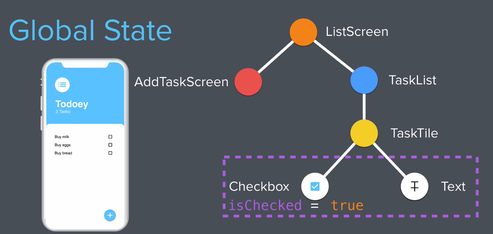

# to_do_flutter

A new Flutter project.

<h5> Move Widgets around </h5>
<pre>

     Container : 
        padding: const EdgeInsets.only(left: 30, top: 60),
        margin:
        width:
        height:

</pre>

<h5> Radius Property </h5>
<pre>

    Container(
        decoration: const BoxDecoration(
          color: Colors.white,
          borderRadius: BorderRadius.only(
              topLeft: Radius.circular(30),
              topRight: Radius.circular(30)),
        ),
      ),

</pre>

<h5> Floating Action Button </h5>
<pre>

    return Scaffold(
      backgroundColor: Colors.lightBlue,
      floatingActionButton: FloatingActionButton(
        onPressed: () {},
        backgroundColor: Colors.white,
        child: const Icon(Icons.add, color: Colors.lightBlueAccent),
      ),);
      
</pre>

<h5> List View </h5>
<pre> 
https://api.flutter.dev/flutter/widgets/ListView-class.html
https://docs.flutter.dev/cookbook/lists/long-lists

The standard ListView constructor works well for small lists. 
To work with lists that contain a large number of items, it’s best to use the ListView.builder constructor.

    child: ListView(
        children: [

          ListTile(
            title: const Text('Buy milk '),
            // leading: const Text('Buy milk'),
            trailing: Checkbox(
              value: true,
              onChanged: (value) {
                //
              },
            ),
          ),

          ListTile(
            title: const Text('Buy milk '),
            // leading: const Text('Buy milk'),
            trailing: Checkbox(
              value: true,
              onChanged: (value) {
                //
              },
            ),
          ),

        ],
    ),

</pre>

<h5> Bottom Sheet(fixed) /  Bottom Sheet pop up modal </h5>
<pre> 

On Hover it shows, it requires context and a builder which is a Function of type widget which takes current context

Future<T?> showModalBottomSheet<T>({
  required BuildContext context,
  required Widget Function(BuildContext) builder,
})

      floatingActionButton: FloatingActionButton(
        onPressed: () {

          showModalBottomSheet(
            context: context,
            builder: (context) => const Text('data'),
          );

        },
      );

or Create a widget with a name and pass that name to the builder

    //widget name : popupBottombuild
      Widget popupBottombuild(BuildContext context) {
        return const Center(child: Text('hello'));
      }

        onPressed: () {

          showModalBottomSheet(
            context: context,
            builder: (popupBottombuild),  //pass the above widget name here as popupBottombuild
          );

        },

</pre>

<h5>Input Text Field</h5>
<pre>

        TextField(
              autofocus: true,
              textAlign: TextAlign.center,
            ),
</pre>

Adding Functionality

<h5>State Management</h5>
<pre>
Local State
    only in a single stateful widget
    not applicable to other widget tree elements.

Global State 
   state has acess to other widget tree elements.
</pre>

<h5> Understanding States </h5>
<pre>

Convert the Checkbox as seperate stateful widget.
because need the state when user press the check box

    return Checkbox( 
      activeColor: Colors.lightBlue,
      value: isChecked,
      onChanged: (giveMeCheckBoxState) {
        setState(() {
          isChecked = giveMeCheckBoxState!;
        });
      },
    );

to 

    class CheckBoxSeperate extends StatefulWidget {
      const CheckBoxSeperate({
        super.key,
      });

      @override
      State<CheckBoxSeperate> createState() => _CheckBoxSeperateState();
    }

    class _CheckBoxSeperateState extends State<CheckBoxSeperate> {

      //variable to check if user pressed it or not
      //default false
      bool isChecked = false;

      @override
      Widget build(BuildContext context) {
        return Checkbox( 
          activeColor: Colors.lightBlue,
          value: isChecked,                       //checkbox value
          onChanged: (giveMeCheckBoxState) {      //when user press pass the value to set state
            setState(() {
              isChecked = giveMeCheckBoxState!;   //update the boolvlaue isChecked.
            });
          },
        );
      }
    }

This functionality is limited to only the Check box widget
which was extracted as stateful widget. 
But we want the isChecked value to be available allover our app
Now we want to strike through the task title based on isChecked which is another Widget.

Move the 
  bool isChecked = false;
to the Task Tile which was stateless Widget.

since stateless widget are immutable convert it into stateful widget
pass the isChecked into the CheckBoxSeperate(isChecked)

    class TaskTile extends StatefulWidget {
      const TaskTile({
        super.key,
      });

      @override
      State<TaskTile> createState() => _TaskTileState();
    }

    class _TaskTileState extends State<TaskTile> {
      bool isChecked = false;

      @override
      Widget build(BuildContext context) {
        return const ListTile(
          title: Text(
            'Buy milk ',
            style: TextStyle(decoration: TextDecoration.lineThrough),
          ),
          trailing: CheckBoxSeperate(isChecked),
        );
      }
    }

Since the stateful widget itself takes care of rendering,
what kind of check bod need to be displayed ,here the CheckBoxSeperate(),

So convert our CheckBoxSeperate(), stateful widget to stateless widget

    class CheckBoxSeperate extends StatefulWidget {
      const CheckBoxSeperate({
        super.key,
      });

      @override
      State<CheckBoxSeperate> createState() => _CheckBoxSeperateState();
    }

    class _CheckBoxSeperateState extends State<CheckBoxSeperate> {
      @override
      Widget build(BuildContext context) {
        return Checkbox(
          activeColor: Colors.lightBlue,
          value: isChecked,
          onChanged: (giveMeCheckBoxState) {
            setState(() {
              isChecked = giveMeCheckBoxState!;
            });
          },
        );
      }
    }

to

since setState is there, you cant convert to stateless widget
seperate the set state then convert to stateless widget as follows 

    class CheckBoxSeperate extends StatelessWidget {

      final bool checkBoxState,

      const CheckBoxSeperate({
        super.key,
        required this.checkBoxState,
      });

      @override
      Widget build(BuildContext context) {
        return Checkbox(
          activeColor: Colors.lightBlue,
          value: checkBoxState,
          onChanged: (giveMeCheckBoxState) {

          },
        );
      }
    }

Notice that Inorder to use a stateless widget
the required parameters Should be in final, 
They are immutable, once it's built.

          final bool checkBoxState,

Then to build the Widget it requires a CONSTRUCTOR
which requires the parameters which are final as above.
In this case the checkBoxState.

      const CheckBoxSeperate({
        super.key,
        required this.checkBoxState,
      });

then you can use the final parameters in the required place.

      Widget build(BuildContext context) {
        return Checkbox(
          activeColor: Colors.lightBlue,

          value: checkBoxState,  //the final checkBoxState is used in the stateless widget passed via constructor.

          onChanged: (giveMeCheckBoxState) {
          },
        );
      }

Now when manually when we set the value of  isChecked true, the checkbox is true and flase is unchecked.
but we need to make it like this when user clicks.
By CALLBACKFUNCTION using SETSTATE. we can achieve this in the TaskTile Widget.

      bool isChecked = true;

      void checkBoxCallBack(bool currentCheckBoxState) {
        setState(() {
          isChecked = currentCheckBoxState;
        });
      }

Pass this Function to the stateless widget,
so when user clicks the check box everytime this function gets called.
[ Note we are passing the toggleCheckBoxState as final which is a type FUNCTION ]
which then sets the state.

error in Function type cant take value bool as void.
so kept as Function(bool?) and nullable in the set state 

In the stateless Check box widget

      final bool checkBoxState;
      
      //final Function/dynamic toggleCheckBoxState, error one
      
      final void Function(bool?) toggleCheckBoxState;

      const CheckBoxSeperate({
        super.key,
        required this.checkBoxState,
        required this.toggleCheckBoxState,
      });

     @override
      Widget build(BuildContext context) {
        return Checkbox(
          activeColor: Colors.lightBlue,
          value: checkBoxState,
          onChanged: toggleCheckBoxState,    //Note calling the callback fucntion here don't pass value here
        );
      }

In the TaskTile stateful widget
error in Function type cant take value bool as void.
so kept as Function(bool?) and nullable in the set state,   isChecked = currentCheckBoxState!;

    class _TaskTileState extends State<TaskTile> {
      bool isChecked = true;

      //callback function here
      void checkBoxCallBack(bool? currentCheckBoxState) {
        setState(() {
          isChecked = currentCheckBoxState!;
        });
      }

      @override
      Widget build(BuildContext context) {
        return ListTile(
          title: Text(
            'Buy milk ',
            style: decoration: isChecked ? TextDecoration.lineThrough : null,
          ),
          trailing: CheckBoxSeperate(
            checkBoxState: isChecked,
            toggleCheckBoxState: checkBoxCallBack,    //Note calling the callback fucntion here don't pass value here
          ),
        );
      }
    }
</pre>

<h5> Lists </h5>
<pre>
Dynamic Lists in the UI
Make the TASK LIST as stateful widget
Create a class under models/task.dart as Task

    class Task {
      final String userTask;
      bool isUserFinished;

      Task({required this.userTask, required this.isUserFinished});

      void toggleisUserFinished() {
        isUserFinished = !isUserFinished;
      }
    }

Task list 

      class _TaskListState extends State<TaskList> {

        //from the class task list
        List<Task> usertasks = [
          Task(userTask: 'Beat Elon Musk', isUserFinished: true),
          Task(userTask: 'Beat Zuckerberg', isUserFinished: true),
          Task(userTask: 'Beat Bezos', isUserFinished: true),
        ];

        @override
        Widget build(BuildContext context) {

          //return listvide builder here
          return ListView.builder(
            itemBuilder: (context, index) {

              //return our tasktile here
              return TaskTile(

                //this is list tile builder for stateless widget.
                //which takes 3 parameters userTaskTitle(string),isUserFinished(bool),toggleCheckBoxState(function)

                userTaskTitle: usertasks[index].userTask,
                isUserFinished: usertasks[index].isUserFinished,

              //sets toglle at check box
                toggleCheckBoxState: (bool? somethingAnonymous) {

                  setState(() {
                    usertasks[index].toggleisUserFinished(); //calling the fucntion in the task class to toggle.
                  });

                },
              );
            },
            itemCount: usertasks.length, //produce lit tile till the end of list
          );
        }
      }

//Final stateless widget which updates the UI list tile

    class TaskTile extends StatelessWidget {

      //required parameters 
      final String userTaskTitle;
      final bool isUserFinished;
      final void Function(bool?) toggleCheckBoxState;

      
      //construct them
      const TaskTile({
        super.key,
        required this.userTaskTitle,
        required this.isUserFinished,
        required this.toggleCheckBoxState,
      });

      @override
      Widget build(BuildContext context) {
        return ListTile(
          title: Text(
            userTaskTitle,  //text task here
            style: TextStyle(
                decoration: isUserFinished ? TextDecoration.lineThrough : null),  //strike or leave it
          ),
          trailing: Checkbox(
            activeColor: Colors.lightBlue,
            value: isUserFinished,
            onChanged: toggleCheckBoxState,  //function here
          ),  
        );
      }
    }

</pre>

<h5> Provider State Management Package</h5>
<pre>
To use our state at different widgets.
if we use local state with setstate, we have to use constructor at all the widgets to reach the widget we want.
better we can use Provider to set state  and if other widgets need the state, they will subscribe to provider.

Top Level

    String data = "My top level string";
    Provider<String> (
      builder : (context){
        return data;
      }
    );

    Different widget 
    return Text(Provider.of<String>(context)) 

At Different Widget tree

    class Something extends ChangeNotifier{

      String data = "Wherever I will change";

      void changeString(String newString){
        data = "newString";
        notifyListners();
      }
    }

    1. return Text(Provider.of<Data>(context).data);

    2. Input type which update the above.
        return TextField(
          onChanged: (someText){
            Provider.of<Data>(context).changeString(someText);
          }
        ),

    3. places which don't want to update
     return Text(Provider.of<Data>(context, listen: false).data);
</pre>

<h5>Using Provider in this APP</h5>
<pre>

1.Top level main.dart

  method takes TaskData as input from Task Data class

task.dart

    class Task {
      final String userTask;
      bool isUserFinished;

      Task({required this.userTask, required this.isUserFinished});

      void toggleisUserFinished() {
        isUserFinished = !isUserFinished;
      }
    }

task_data.dart creating task from above class Task

      class TaskData extends ChangeNotifier {
        List<Task> usertasks = [
          Task(userTask: 'Beat Elon Musk', isUserFinished: true),
          Task(userTask: 'Beat Zuckerberg', isUserFinished: true),
          Task(userTask: 'Beat Bezos', isUserFinished: true),
        ];

        int get tasksCount {
          return usertasks.length;
        }
      }

main.dart passing above class TaskData

    return ChangeNotifierProvider(
      create: (context) => TaskData(),
      child: const MaterialApp(
        home: HomePage(),
      ),
    );

2. Next top level widget Task Lists, wrap with the consumer with <TaskData> 
   which has,  builder: (context, taskData, child)
   tap into taskData property to access the tasks

        return Consumer<TaskData>(
          builder: (context, taskData, child) {
            return ListView.builder(
              itemBuilder: (context, index) {
                return TaskTile(
                  userTaskTitle: taskData.usertasks[index].userTask,    
                  isUserFinished: taskData.usertasks[index].isUserFinished,
                  toggleCheckBoxState: (bool? somethingAnonymous) {
                    // setState(() {
                    //   usertasks[index].toggleisUserFinished();
                    // });
                  },
                );
              },
              itemCount: taskData.usertasks.length,
            );
          },
        );

</pre>

<h5>Adding new tasks</h5>
<pre>

</pre>
